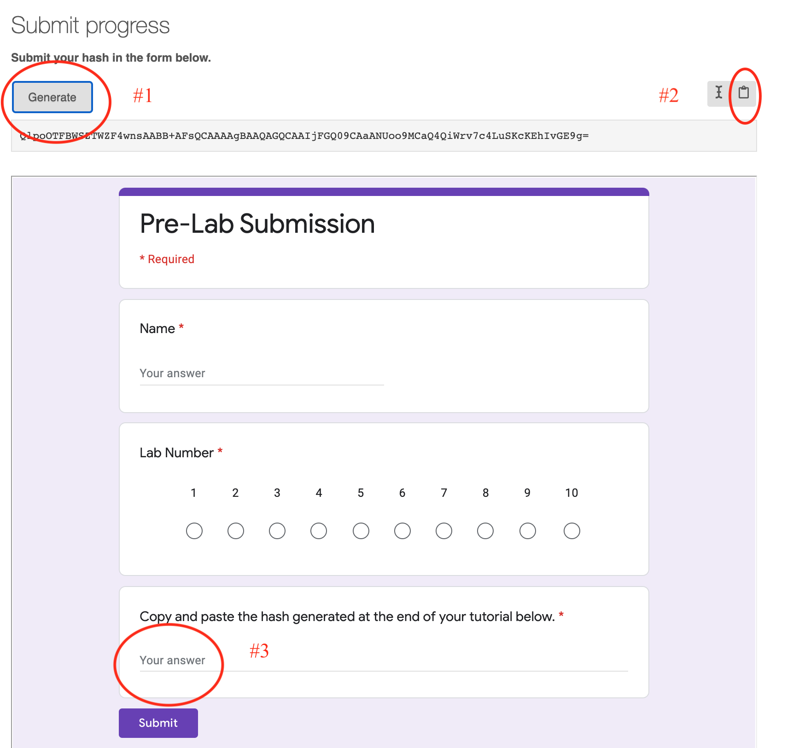

# nudgeStatLabs
## learnr labs for intro stat

### To install this package:

1. One time only:

`install.packages("devtools")`

2. One time only (may need to reinstall for updates throughout the semester):

`devtools::install_github("sastoudt/nudgeStatLabs")`

### Launch a lesson*:

1. `learnr::run_tutorial("lesson1", "nudgeStatLabs")`

### Stop a lesson 

1. Click stop sign on the left (use the one on the right if *).

#### *If you get an error on the RStudio Server:

1. Launch the lesson (go to Tutorial tab in upper right, scroll to find the nudgeRlabs tutorial, click "Start Tutorial")

2. Open in a bigger screen (click the middle icon that has a window and arrow)

## Available Tutorials

- "lesson1": Exploring data
- "lesson2": Introduction to data
- "lesson3": Foundations for statistical inference - Sampling distributions
- "lesson4": Foundations for statistical inference - Confidence intervals
- "lesson5": Probability
- "lesson6": Inference for numerical data
- "lesson7": Inference for categorical data
- "lesson8": Introduction to linear regression
- "lesson9": Multiple linear regression
- "lesson10": The normal distribution
- "lesson11": When the bootstrap fails
- "roadless_collect": Collect data for [Roadless America](https://www.amstat.org/asa/files/pdfs/stew/PercentWithinMileofRoad.pdf) activity

## Lab Instructions

There will be a pre-lab and a lab report for each lab. The pre-lab will be completed individually and graded for completion. This is **due by noon on Thursdays**. Then during lab you will work in a team of three to complete a lab report. If you finish early you can use the time to work on the homework due the following day.Pre-lab is submitted as a Google Form (see below). Lab report submitted to Moodle as LastName-LastName-LastName-L-LabNumber.Rmd and LastName-LastName-L-LabNumber.html The lab report is **due before class on the Monday following the lab**.

## How to Submit Pre-Lab

