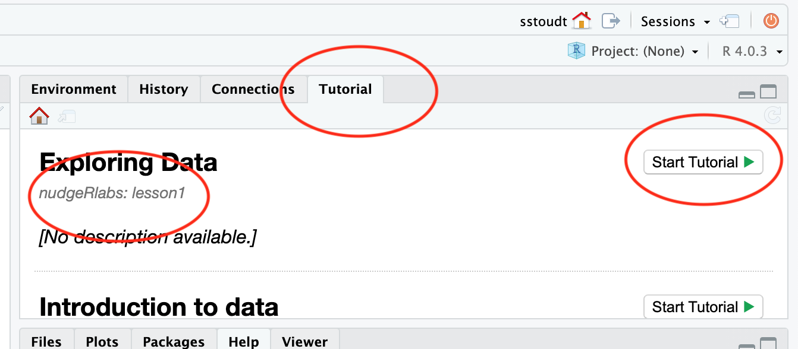
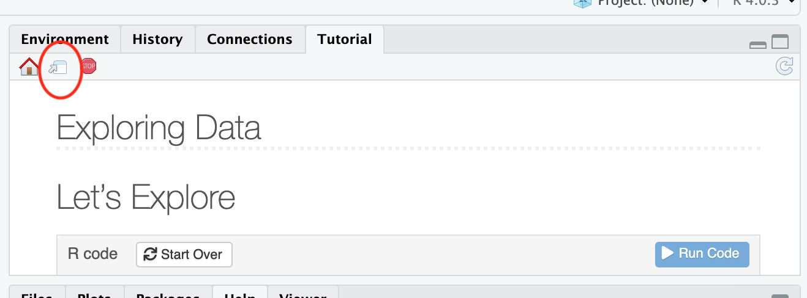

# nudgeRlabs
learnr labs for intro stat

To install this package:

1. One time only:

`install.packages("devtools")`

2. One time only (may need to reinstall for updates throughout the semester):

`devtools::install_github("sastoudt/nudgeRlabs")`

3. Launch a lesson*:

`learnr::run_tutorial("lesson1", "nudgeRlabs")`

4. Stop a lesson (click stop sign on the left, use the one on the right if *):

*If you get an error on the RStudio Server:

Launch the lesson (go to Tutorial tab in upper right, scroll to find the nudgeRlabs tutorial, click "Start Tutorial")

Open in a bigger screen (click the middle icon that has a window and arrow)

## Available Tutorials

- "lesson1": Exploring data
- "lesson2": Introduction to data
- "lesson3": Foundations for statistical inference - Sampling distributions
- "lesson4": Foundations for statistical inference - Confidence intervals
- "lesson5": Probability
- "lesson6": Inference for numerical data
- "lesson7": Inference for categorical data
- "lesson8": Introduction to linear regression
- "lesson9": Multiple linear regression
- "lesson10": The normal distribution
- "lesson11": When the bootstrap fails
