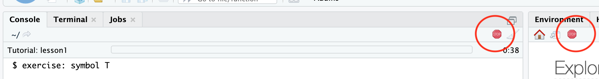
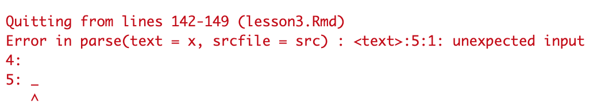
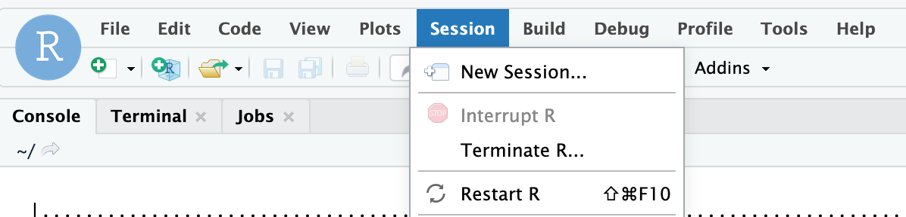
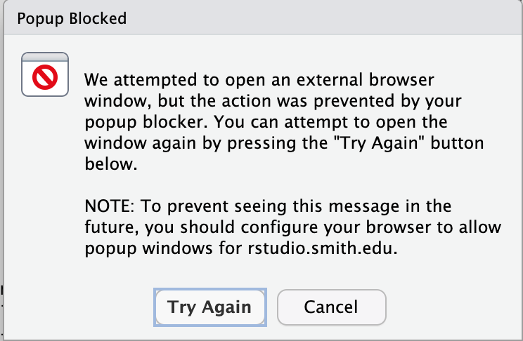

# nudgeStatLabs
## learnr labs for intro stat
These labs were originally adapted from labs for Open Intro ISRS by [Dr. Sara Stoudt](https://sastoudt.github.io/). 
This repo was forked from her [original one](https://github.com/sastoudt/nudgeStatLabs)

**For instructors:** an overview of how Dr. Stoudt used this set of learnr labs in an intro stats class can be found [here](https://sastoudt.github.io/posts/2021-06-05-learnr-tutorials-intro-stat/).

Note for Smith Students: For now, only do this on your own personal RStudio, not on the Smith server. If you only have access to the server, let me know, and we will use a work around.

### To install this package:

0. One time only:

`install.packages("devtools")`

1. One time only (may need to reinstall for updates throughout the semester). 

`remove.packages("learnr") ## might not need this if you do not have learnr pre-installed`

`remotes::install_github("rstudio/learnr")`

`remotes::install_github("rstudio-education/gradethis")`

`remotes::install_github("kmkinnaird/nudgeStatLabs")`


2. Thanks to Marney for this one: after install is complete (I know this seems weird, but go with it):

```remove.packages("htmltools")```

```install.packages("htmltools")```

Exit RStudio and then open it again.

#### Troubleshooting

- These packages have more recent versions available. Which would you like to update? --> If the list only includes `htmltools` say No.

- Do you want to install from sources the package which needs compilation? (in reference to `dplyr 1.0.3` instead of `dplyr 1.0.4`) --> No 

- For all other situations: When asked which packages you would like to update, select `1: All`. If you are asked if "you want to install from sources the package which needs compilation?", please also say `Yes`

### Launch a lesson:

1. In the console (bottom left) type: `learnr::run_tutorial("lesson1", "nudgeStatLabs")`

### Stop a lesson 

1. Click stop sign on the left.



#### Troubleshooting

- If you get some kind of error having to do with "parse" when you try to run a tutorial:
 

Click "Session" --> "Restart R" and try to run the tutorial again. 

 

- The tutorial will often pop up in a new browser tab automatically. If you have a popup blocker, you might need to turn it off or update the settings.

 

## Available Tutorials

- "lesson1": Exploring data
- "lesson2": Introduction to data
- "lesson3": Foundations for statistical inference - Sampling distributions
- "lesson4": Foundations for statistical inference - Confidence intervals
- "lesson5": Probability
- "lesson6": Inference for numerical data
- "lesson7": Inference for categorical data
- "lesson8": Introduction to linear regression
- "lesson9": Multiple linear regression
- "lesson10": The normal distribution
- "lesson11": When the bootstrap fails
- "roadless_collect": Collect data for [Roadless America](https://www.amstat.org/asa/files/pdfs/stew/PercentWithinMileofRoad.pdf) activity

## Lab Instructions

There will be a pre-lab and a lab report for each lab. The pre-lab will be completed **individually** and graded for completion. This is **due by 9am on Thursdays**. Then during lab you will work in a team of three to complete a lab report. If you finish early you can use the time to work on other assignments for the course. Pre-lab is submitted as a Google Form (see below). Lab report submitted to Moodle as LastName-LastName-LastName-L-LabNumber.Rmd and LastName-LastName-L-LabNumber.html The lab report is **due on the Friday following the lab**.

#### Troubleshooting

I can't see the Google Form at the end. 

Open in the browser (this should happen automatically if you use `run_tutorial` ), use Google Chrome, and make sure you are logged in to your Smith e-mail in the same browser (only Smith authenticated accounts can access the form to avoid any spam).

**Run into any problems not listed above? Let me know and when we figure it out we'll add to the list.**


